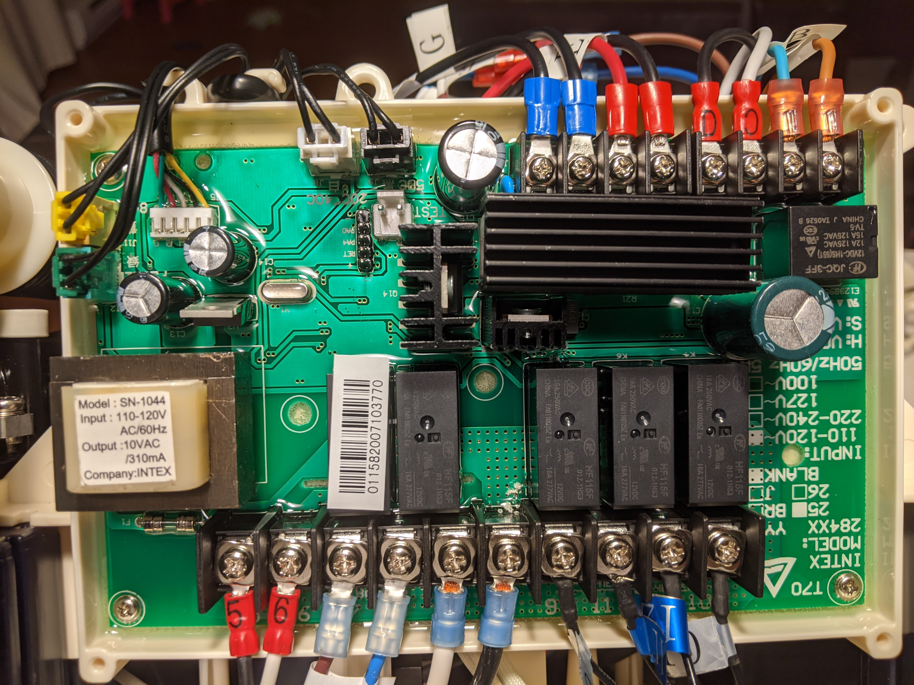
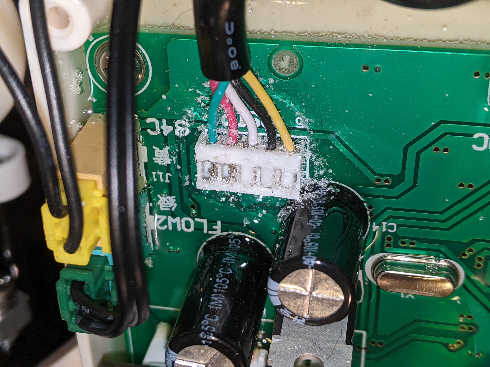
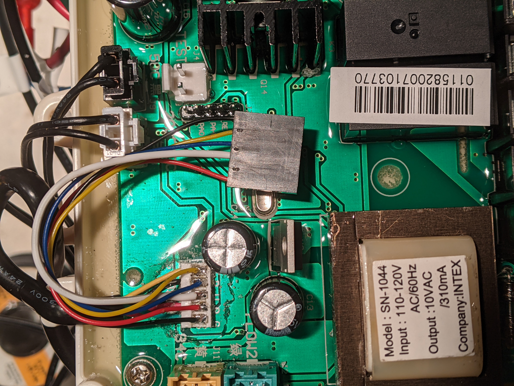
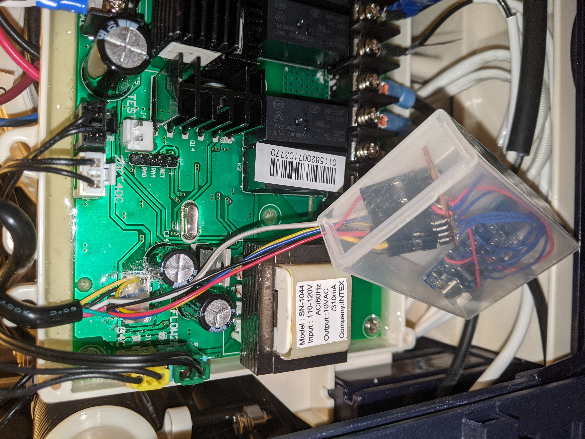

# IntexSpaManager
This project adds the ability to control and monitor an Intex PureSpa (SB-H10) inflatable hot tub over a wifi connection.

Portions of code have been copied from UlrichMai's MaiPureSpaController:
https://github.com/UlrichMai/MaiPureSpaController

MaiPureSpaController looks to have copied code from tinwhisker's IntexSpaRemote:
https://github.com/tinwhisker/IntexSpaRemote


You will need:
- Intex PureSpa SB-H10
- ESP8266 (I used a d1 mini clone)
- soldering iron
- solder
- wires
- optional temperature sensor (DS18S20)

The display unit of the SB-H10 seemed impossible to open so I modified the main pcb of the base(pump/heater) unit.

## Compiling the firmware
I use Visual Studio Code with the PlatformIO extension.

Once the code has been loaded onto the D1 Mini, updating the firmware can be done over the air (OTA) from VSCode/PlatformIO

Before compiling, enter your MQTT settings in SpaMQTT.cpp. 

```
#define mqtt_server "192.168.31.107"
#define mqtt_user "" //enter your MQTT username
#define mqtt_password "" //enter your password
```
I may make this a runtime configurable setting if anyone besides myself uses this.


## Preparing the main board of the base unit
Open up the base unit by removing several screws. Slide the plastic up to expose the internals. The main board is at the back of the unit behind a plastic shield that must also be removed.



Once exposed, remove the weatherproofing goo from the J5 connector(top left). The J5 connector is where the cable that comes from the display unit connects to the main board.



## Connecting the D1 Mini
I soldered a connector to the main board so I could easily unplug my d1 mini if needed. You could just as easily solder the d1 mini directly to the mainboard pcb.

### Diagram
Note that the colors of the wires in the diagram match the color of the wires on the main board pcb. The temperature sensor on the right hand side is an optional addition to get air temperature.


### Schematic


### Connector Soldered
After the goo is removed, I broke off some of the white plastic tabs of the J5 connector to espose areas to solder wires to.


### D1 mini attached
Hot glue added over solder and d1 mini plugged in and put in a plastic box (from a bicycle patch kit).



## Connecting the D1 Mini to your home WiFi
Once everything has been soldered, plug the unit in to make sure the modification works properly.

Pressing the temperature unit button 4 times quickly will cause the d1 mini to create a wifi hotspot. When you connect directly to the hotspot you will be prompted to enter the settings for your home wifi access point.

Take note of the hotspot name, you will need this when configuring your MQTT client or Home Assistant. It will be something like this: __IntexSpa-233c21__

## MQTT

Replace __IntexSpa-233c21__ with your spa's name in the following:

### Getters
Topic | value
------|-------
IntexSpa-233c21/availability | online / offline
IntexSpa-233c21/power | on/off
IntexSpa-233c21/heating_enabled |true/false
IntexSpa-233c21/heating | true/false
IntexSpa-233c21/filter | on/off
IntexSpa-233c21/bubbles | on/off
IntexSpa-233c21/target_temp | number
IntexSpa-233c21/temp | number
IntexSpa-233c21/air_temp | number
IntexSpa-233c21/temp_units | C/F
// topics specific for home assistant mqtt climate platform
IntexSpa-233c21/ha_action | idle heating off cooling drying
IntexSpa-233c21/ha_mode   | off cool heat dry

### Setters

| Topic |
| ------|
||IntexSpa-233c21/power/set|
|IntexSpa-233c21/heating_enabled/set|
|IntexSpa-233c21/filter/set|
|IntexSpa-233c21/bubbles/set|
|IntexSpa-233c21/target_temp/set|
|IntexSpa-233c21/temp_units/set|
|// topics specific for home assistant mqtt climate platform |
|IntexSpa-233c21/ha_mode/set |


## Home Assistant Settings
```
climate:
  - platform: mqtt
    name: Hot Tub
    availability_topic: "IntexSpa-233c21/availability"
    power_state_topic: "IntexSpa-233c21/power"
    power_command_topic: "IntexSpa-233c21/power/set"
    modes:
      - "off"
      - "cool"
      - "heat"
      - "dry"
    mode_command_topic: "IntexSpa-233c21/ha_mode/set"
    mode_state_topic: "IntexSpa-233c21/ha_mode"
    action_topic: "IntexSpa-233c21/ha_action"
    fan_modes:
      - "off"
      - "on"
    fan_mode_state_topic: "IntexSpa-233c21/bubbles"
    fan_mode_command_topic: "IntexSpa-233c21/bubbles/set"
    temperature_unit: "C"
    current_temperature_topic: "IntexSpa-233c21/temp"
    temperature_state_topic: "IntexSpa-233c21/target_temp"
    temperature_command_topic: "IntexSpa-233c21/target_temp/set"
    min_temp: 20
    max_temp: 40
    temp_step: 1
    precision: 1
    send_if_off: false
    retain: false
    unique_id: "IntexSpa-233c21"
```
